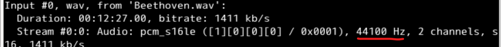
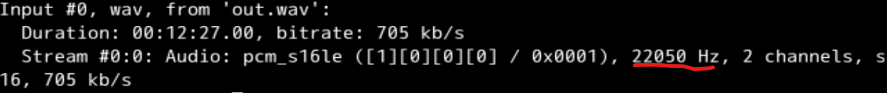

# GDB 调试过程记录
首先编译：`gcc -g problem.c`  
进入gdb，开始调试：`gdb a.out`  
`run Beethoven.wav out.wav` 设置参数并执行（我下载了代码注释里提供的音频文件）  
检测到 102 行存在非法内存访问（触发 SEGV 信号  
通过 `l` 检查周围代码，发现了许多问题  
修改如下：  
- 99行： 将 `content` 从 VLA 更改成 `malloc` 申请变量
- 100行： `content[lenth]` 更改为 `content[lenth-1]`
- 102行： `fread` 的第三个参数（`count`）更改为 lenth

~~吐槽：这 length 拼写也有问题233333~~    

重新编译，再次调试： 
这次检测到 `free` 出现了非法内存访问，推测为对同一个内存调用了两次 `free`  
`backtrace` 查看调用堆栈，得知 `write_wav` 函数中位于 120 行的代码调用了这次 `free`  
通过 `l` 查看周围代码，目测此处因为写完文件正常的内存释放。继续向上寻找其他 `free` 调用。  
通过阅读代码，发现早在 80行 处就调用了一次 `free`，故注释掉该行。
再次编译，程序正常运行。通过 `ffprobe` 对比输入和输出文件，可以看到 `out.wav` 的采样率是 `Beethoven.wav` 的一半。  
**附图：**  
`ffprobe` 的输出：  

# 备注
`problem.c` 为原问题文件  
`problem.fix.c` 为调试后改正的代码
